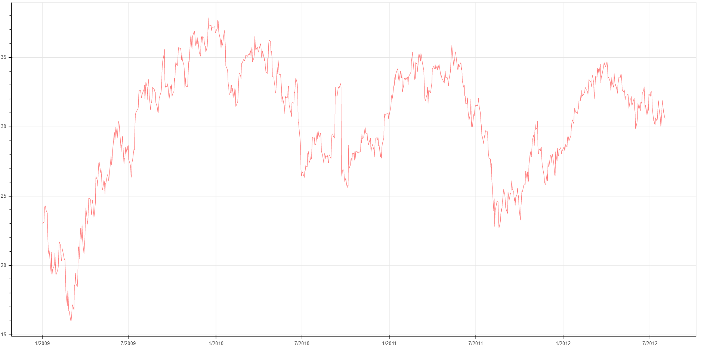

# Bokeh-Time-Series-Plotting
Visualising time series data using Bokeh library.
  
A **time series graph** is a line graph of repeated measurements taken over regular time intervals. In time series graphs, time is always shown on horizontal axis and the measurements on the vertical axis. Time series graphs help to show trends or patterns.
  
The plotting has been done for the data in "Close" column in **adbe.csv** file according to the dates provided. The plotting can be done for other columns as well. The code for time series visualisation has been provided in the **Time_Series_Plot.ipynb** Jupyter notebook. The output will be stored in **Timeseries.html** file. Also, snapshot of the graph is been given below.

    

**Snapshot**

  

